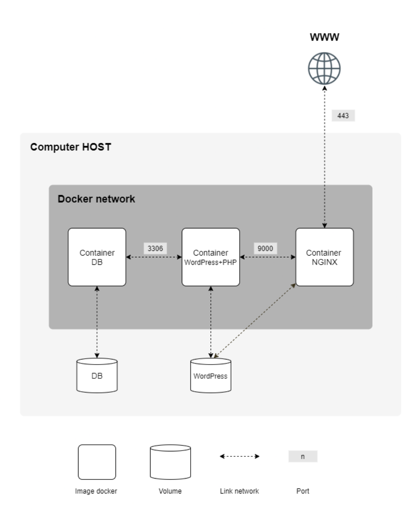

# 🐳 Dockerized Infrastructure Project: WordPress + NGINX + MariaDB


## 📋 Project Overview

This project demonstrates how to set up a small virtualized infrastructure using **Docker** and **Docker Compose**. The setup includes multiple services running in isolated containers, showcasing best practices in system administration and container orchestration.
<p align="center">
    
</p>

🚀 **Features:**
- TLS-secured **NGINX** (TLSv1.2 or TLSv1.3 only) 🌐
- Fully configured **WordPress** with `php-fpm` 📝
- A standalone **MariaDB** container for database management 🗄️
- Persistent volumes for database and WordPress website files 📂
- Inter-container communication via a custom **Docker network** 🔗

---

## 📦 Project Structure
- **srcs/**: Contains all configuration files (Dockerfiles, WordPress, MariaDB setup).
- **Makefile**: Automates building and running the project.
- **docker-compose.yml**: Defines the service configurations.

---

## 🛠️ Setup Instructions

### 📋 Prerequisites

Ensure the following are installed on your system:
- 🐧 **Linux Virtual Machine** (Mandatory)
- 🐳 **Docker** + 🛠️ **Docker Compose** 

Here's a merged version of your instructions, combining the steps to set up the environment with the steps to run the project:

---

## 🚀 Steps to Run the Project

1. **Clone this repository**  
   Run the following command to clone the repository to your local machine:
   ```bash
   git clone git@github.com:elmehdi-kenane/inception.git
   ```

2. **Set up the environment variables**  
   The project requires specific environment variables to be configured. Follow these steps:

   1. **Locate the `env_sample` file**  
     The file can be found in the root directory of the repository.

   2. **Create a `.env` file**  
     Copy the `env_sample` file to create a new `.env` file:
     ```bash
    cd inception
    cp env_sample .env
     ```

   3. **Edit the `.env` file**  
     Open the `.env` file in a text editor and fill in the required values.

3. **Build and run the infrastructure using the Makefile**  
   Navigate to the project directory and use the `make` command to build and start the project:
   ```bash
   make
   ```

4. Access the services:
   - **NGINX**: [https://localhost](https://localhost)  
   - **WordPress**: Automatically set up and available via NGINX.  
   - **MariaDB**: Pre-configured and ready for database operations.

5. To stop and clean up containers:
   ```bash
   make fclean
   ```

---

## ⚙️ Services and Configuration

### 🌐 NGINX
- Secured with **TLSv1.2** and **TLSv1.3** only.
- Serves as a reverse proxy for WordPress.

### 📝 WordPress
- Installed and configured with `php-fpm`.
- Uses a dedicated volume for website files.

### 🗄️ MariaDB
- Stores WordPress database in a separate volume for persistence.

### 🔗 Docker Network
- Ensures seamless communication between containers.

---

## 🧰 Tools Used

- **Debian** (bullseye).
- **Docker** for containerization.
- **Docker Compose** for orchestration.

---

## 📁 Volumes

- **Database Volume**: Ensures MariaDB data persists across container restarts.
- **Website Files Volume**: Stores all WordPress-related files.

---

## 📜 Makefile Commands

| Command     | Description                              |
|-------------|------------------------------------------|
| `make`      | Builds and starts the project.           |
| `make clean`| Removes all built objects.               |
| `make fclean`| Stops containers and removes images.    |
| `make re`   | Rebuilds the entire project from scratch.|

## Additional Resources 📖
For detailed Q&A and notes about Docker, check out my [Docker Q&A and Notes](./DOCKER_NOTES.md) 🐳.

Enjoy your journey in mastering Docker! 💡